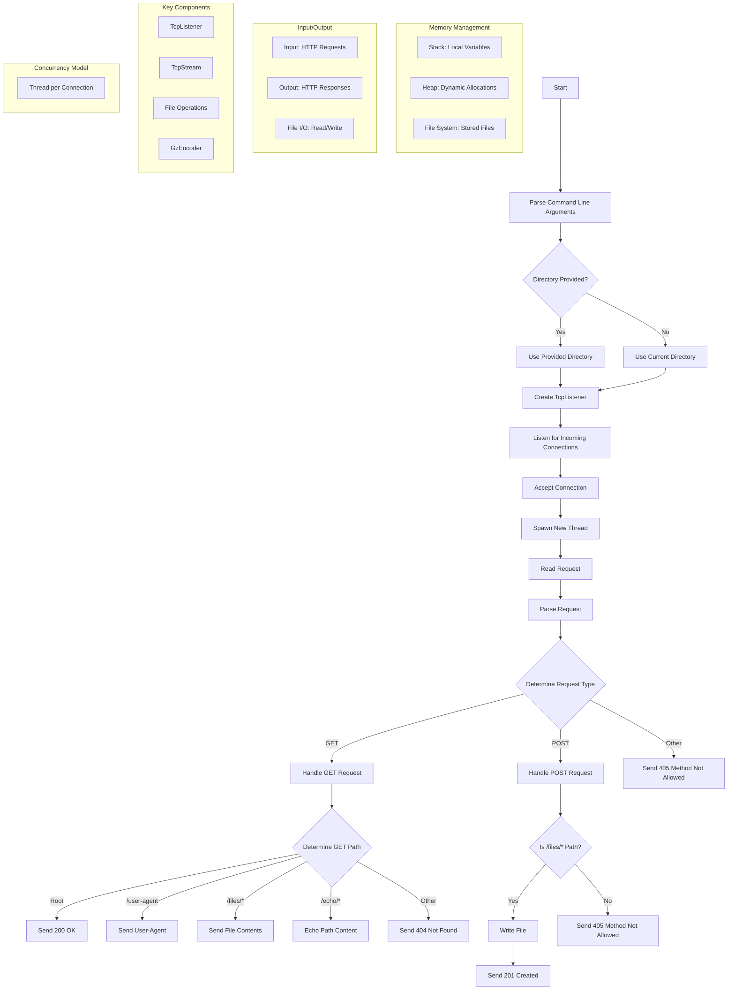

# CHAMA - An HTTP Server Written In Rust

------

CHAMA can:

🗿 Handle `HTTP`, `GET`, and `POST` requests. 

🗿 Provide several endpoints such as `/`, `/user-agent`, `/files/{filename}`, and `/echo/{str}`.

🗿 Manage concurrent connections. 

🗿 Support gzip compression for responses if requested by the client.

<br>

<p align="center">

</p>

<br>

## How CHAMA Works

<br>

## Endpoints

The server provides several endpoints. A GET request to `/` returns a `200 OK` response with an empty body. A GET request to `/user-agent` returns the `User-Agent` header value sent by the client. For the `/files/{filename}` endpoint, a GET request returns the content of the requested file if it exists, otherwise it returns a `404 Not Found` response. The `/echo/{str}` endpoint echoes the string provided in the URL. The server also supports POST requests to the `/files/{filename}` endpoint, saving the request body as a file with the given filename.

<br>

## CHAMA In Action

 GET request to the root URL:
```sh
curl -v http://localhost:4221/
```
Testing the `/user-agent` endpoint:
```sh
curl -v -H "User-Agent: custom-agent" http://localhost:4221/user-agent
```
Requesting files:
```sh
echo "Hello, World!" > /tmp/hello.txt
curl -v http://localhost:4221/files/hello.txt
```
Echo endpoint:
```sh
curl -v http://localhost:4221/echo/hello
```
Saving data to a file via a POST request:
```sh
curl -v -X POST --data "This is a test file." http://localhost:4221/files/test.txt
```

<br>

## Make It Your Own

To use CHAMA, your system must have [Rust](https://www.rust-lang.org/tools/install) installed. 

First, clone the repository with the command:
```sh
git clone https://github.com/V3D4NTH/CHAMA
cd CHAMA
```
Build the project using:
```sh
cargo build --release
```
You can then run the server with:
```sh
./target/release/http-server-starter-rust --directory /path/to/serve
```


